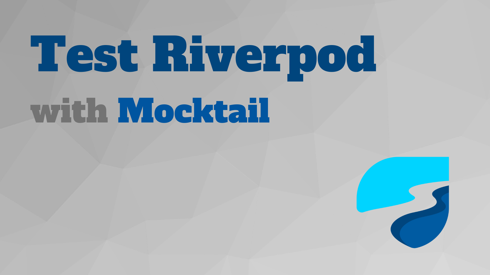

# test-Riverpod-with-Mocktail

This example teaches you how to test with Mocktail for your Riverpod project. It includes some unit-tests for common situations, like Provider, FutureProvider, AsyncNotifierProvider.

## Contribute
- You can star and share with other developers if you feel good and learn something from this repository.
- If you have some ideas, please discuss them with me or commit PR.

## More of me

## Donate and encourage me
[![BuyMeACoffee][buy_me_a_coffee_badge]][buy_me_a_coffee]

<!-- Links -->
[buy_me_a_coffee]: https://www.buymeacoffee.com/yiichenhi
[buy_me_a_coffee_badge]: https://img.buymeacoffee.com/button-api/?text=Sponsor&emoji=&slug=yiichenhi&button_colour=FFDD00&font_colour=000000&font_family=Cookie&outline_colour=000000&coffee_colour=ffffff&size=64